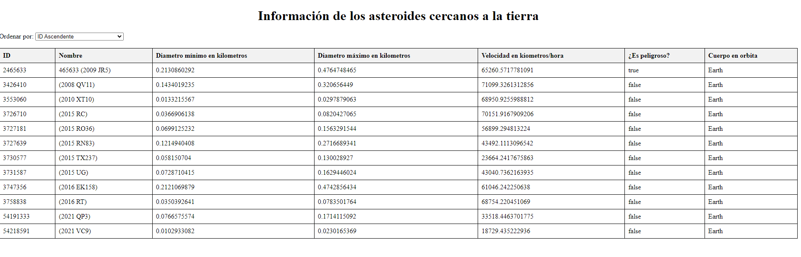

# Nasa_api

Este repositorio contiene una sencilla aplicación web usando un servidor local con node y consumiendo una api de la nasa con javaScript.

## Instalación

Para ejecutar esta aplicación localmente, siga estos pasos:

1. Clonar el repositorio:  abra la terminal y copie el siguiente codigo: git clone https://github.com/your-username/repository-name.git
2. Instala las dependencias: con el comando npm install
3. inicie el servidor con node app.js
4. Abra su navegador web y visite `http://localhost:5000 `para ver la aplicación.

## ¿Cómo usar la app?

La aplicación proporciona una tabla que muestra información sobre asteroides cerca de la Tierra. La tabla tiene las siguientes columnas:

* IDENTIFICACIÓN
* Nombre
* Diámetro mínimo en kilómetros
* Diámetro máximo en kilómetros
* Velocidad en kilómetros por hora
* ¿Es potencialmente peligroso?
* cuerpo en órbita

También puede ordenar los datos de la tabla seleccionando una opción del menú desplegable "Ordenar por". Las opciones de clasificación disponibles son:

* Identificación Ascendente
* Identificación descendente
* Velocidad Ascendente
* Velocidad descendente
* Diámetro máximo ascendente
* Diámetro máximo descendente

